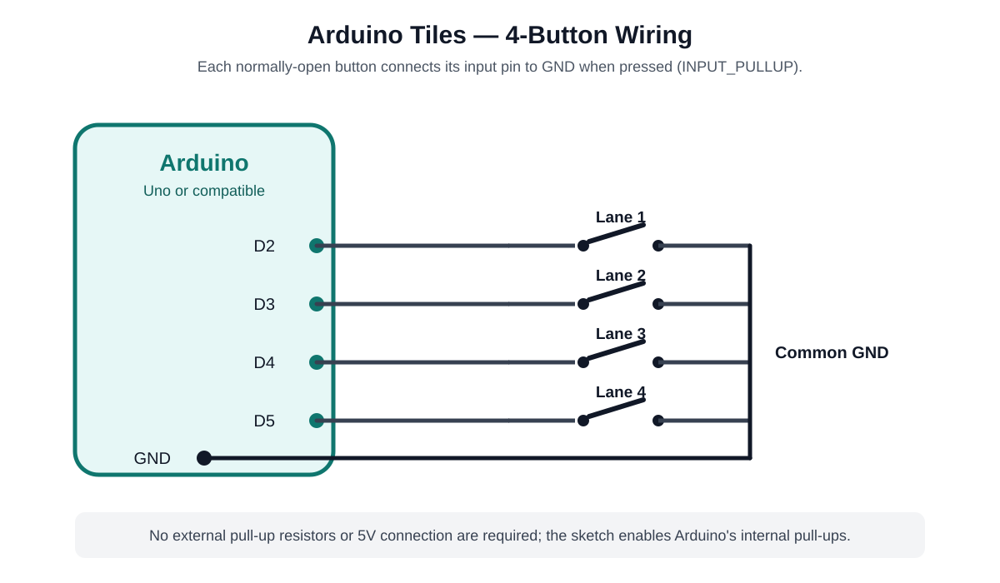

# Arduino Tiles


[](https://creativecommons.org/licenses/by-nc/4.0/)
[](https://shields.io/)

**Arduino Tiles** is a feature-complete clone of *Piano Tiles 2*, a rhythm-based game built using Python with Pygame for the front-end and Arduino for optional hardware input. Players can tap tiles in sync with music using a keyboard, mouse, or four momentary push buttons connected to an Arduino. The game supports JSON-based song files, dynamic difficulty calculation, and a player-synced audio engine for an immersive experience.

<video src="https://github.com/Aieda1l/Arduino-Tiles/raw/refs/heads/master/media/demo.mp4"></video>

## Table of Contents
- [Features](#features)
- [Installation](#installation)
- [Usage](#usage)
- [Hardware Setup](#hardware-setup)
- [Directory Structure](#directory-structure)
- [Contributing](#contributing)
- [License](#license)

## Features
- **Gameplay**: Tap or hold tiles in four lanes to match the rhythm of songs, with support for normal, long, dual, and special tiles.
- **Input Options**: Play using keyboard (keys 1-4), mouse, or four momentary push buttons via Arduino.
- **Song Parsing**: Loads songs from JSON files in `assets/songs/`, with support for multiple difficulty levels (1-3 stars) and seamless level transitions.
- **Dynamic Difficulty**: Calculates song difficulty based on tile types, sequences, and speed (TPS).
- **Audio Engine**: Background accompaniment syncs with player hits, not a fixed timer, for a dynamic music experience.
- **UI**: Polished main menu with a scrollable song list, search bar, difficulty indicators, and song previews.
- **Visuals**: Includes particle effects, rounded rectangles, and gradient-filled long notes for a professional look.

## Installation

### Prerequisites
- **Python 3.13** or later
- **Pygame 2.5.5** (`pip install pygame-ce`)
- **PySerial** for Arduino communication (`pip install pyserial`)
- **Arduino IDE** (1.8.19 or later) for uploading the Arduino sketch
- **Arduino Board** (e.g., Uno) with 4 normally-open momentary push buttons for hardware input (optional)

### Steps
1. Clone or download the repository:
   ```bash
   git clone https://github.com/yourusername/arduino-tiles.git
   cd arduino-tiles
   ```
2. Create a virtual environment and install dependencies:
   ```bash
   python -m venv .venv
   .venv\Scripts\activate  # On Windows
   source .venv/bin/activate  # On Linux/macOS
   pip install pygame-ce pyserial
   ```
3. Ensure the `assets/` directory contains:
   - `songs/` with `.json` song files (e.g., `Havana.json`)
   - `snd/` with `.mp3` sound files (e.g., `c1.mp3`, `#a.mp3`)
   - `img/` with images (`background.png`, `circle_light.png`, `crazy_circle.png`, `dot_light.png`)
   - `fonts/` with `Futura condensed.ttf` and `StarThings-DLZx.ttf`
4. For Arduino input:
   - Open `arduino/arduino_tiles.ino` in the Arduino IDE.
   - Connect four normally-open momentary push buttons to pins 2, 3, 4, and 5 as shown in [Hardware Setup](#hardware-setup).
   - Upload the sketch to your Arduino board.

### Building a Standalone Executable
To create a standalone executable with the `assets/` folder separate:
```bash
pip install pyinstaller
pyinstaller --onedir --windowed --add-data "assets;assets" main.py
```
The executable and dependencies will be in `dist/main/`, with `assets/` copied alongside.

## Usage
1. Run the game:
   ```bash
   python main.py
   ```
2. In the main menu:
   - Use the search bar to filter songs.
   - Click a song to select it, or the play button (▶) for a preview.
   - Click the "Play" button to start the selected song.
3. Gameplay controls:
   - **Keyboard**: Press 1, 2, 3, 4 for lanes 1-4.
   - **Mouse**: Click tiles in the lanes.
   - **Arduino**: Press the corresponding physical button for each lane.
   - Press ESC to return to the main menu.
   - Press 'A' to toggle autoplay (for testing).
4. Objective: Tap or hold tiles as they reach the strike line to score points. Earn up to 3 stars per song based on completion.

## Hardware Setup
For optional Arduino button input:

### Components
- Arduino board (e.g., Uno)
- 4 normally-open momentary push buttons
- Jumper wires
- Breadboard (optional)

### Wiring Diagram



The Arduino sketch configures pins 2-5 with `INPUT_PULLUP`. Each input is therefore normally HIGH and becomes LOW when its button connects the pin to ground. The sketch inverts that signal before sending it to the game, so a pressed button is reported as `1`.

| Lane | Arduino input | Other button terminal |
| --- | --- | --- |
| Lane 1 | D2 | GND |
| Lane 2 | D3 | GND |
| Lane 3 | D4 | GND |
| Lane 4 | D5 | GND |

No external pull-up resistors or 5V connection are required for the buttons.

### Setup
- Arrange the four buttons in a row to correspond to the four game lanes.
- Connect the Arduino to your computer via USB and update `SERIAL_PORT` in `config.py` if needed.
- Upload `arduino/arduino_tiles.ino` using the Arduino IDE.

## Directory Structure
```
arduino-tiles/
├── assets/
│   ├── songs/              # JSON song files (e.g., Havana.json)
│   ├── snd/                # MP3 sound files (e.g., c1.mp3)
│   ├── img/                # PNG images (background.png, etc.)
│   ├── fonts/              # TTF fonts
├── arduino/
│   ├── arduino_tiles.ino   # Arduino code for four momentary push buttons
├── config.py               # Game constants and settings
├── utils.py                # Helper functions (drawing, buttons)
├── arduino_handler.py      # Arduino serial communication
├── tile.py                 # Tile and particle classes
├── song_parser.py          # JSON song parsing logic
├── game.py                 # Main game loop and logic
├── main_menu.py            # Main menu with song selection
├── main.py                 # Application entry point
├── requirements.txt        # Project depedencies
├── README.md               # This file
```

## Contributing
Contributions are welcome! To contribute:
1. Fork the repository.
2. Create a feature branch (`git checkout -b feature/your-feature`).
3. Commit changes (`git commit -m "Add your feature"`).
4. Push to the branch (`git push origin feature/your-feature`).
5. Open a pull request.

Please ensure code follows PEP 8 style guidelines and includes tests where applicable.

## License
This project is licensed under the **Creative Commons Attribution-NonCommercial 4.0 International (CC BY-NC 4.0)** license. See the [LICENSE](LICENSE) file for the full terms.
